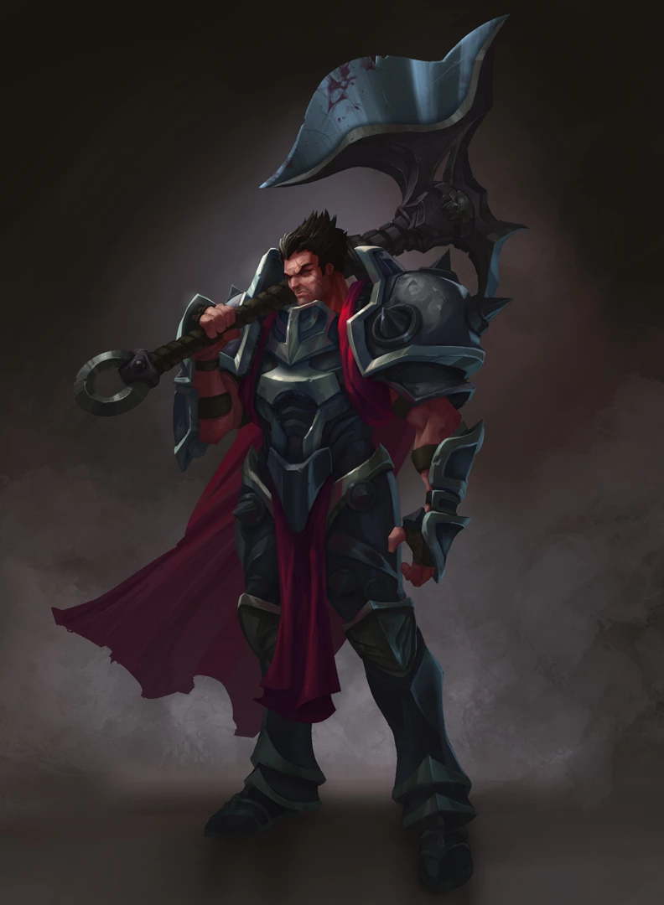

##  诺克萨斯之手-德莱厄斯

##### 我喜欢的一个游戏人物

___

---
#### “历史只记得胜利者。顺应诺克萨斯，你将名垂千古。”

+ 提到诺克萨斯力量的象征，帝国上下没有人能比德莱厄斯这名久经沙场的战士更加适合。他从无名小卒逐渐成长为诺克萨斯之手，劈开了无数敌人的身躯 —— 其中也不乏诺克萨斯自己人。他从不怀疑自己执行的公义，也从不会在举起战斧后迟疑。作为崔法利军团指挥官，德莱厄斯的任何对手都不用指望他手下留情。 
+ 德莱厄斯和他的兄弟德莱文是在港口城市贝西利科长大的孤儿。德莱厄斯艰辛地供养弟弟和自己，始终都要用武力面对年长的孩子们，还有任何威胁到他弟弟的人——甚至包括城市卫兵。街头的每一天都是一场生存的战斗，德莱厄斯十二岁那年夏天赢来的伤疤比有些士兵一辈子的都多。
+ 扩张的诺克萨斯帝国占领贝西利科以后，刚刚得胜的指挥官塞勒斯在这对不受管教的两兄弟身上看到了力量，于是他的军队就成为了兄弟二人的家。随后的年岁中，他们参与了许多次血腥的征服战役，足迹横跨整个已探知的世界，也曾多次为帝国镇压叛乱。
+ 在帝国内部，任何人都可以掌权得势，不论出身、文化或履历，而德莱厄斯正是这一理想最狂热的追随者。他从一个无名小卒，在军阶中稳步攀升，始终都将使命放在最高的位置，而且也凭借自己的凶悍、自律和死不退让的态度赢得了许多尊敬。在达拉莫平原的血染战场上，他甚至斩首了一位诺克萨斯将军，因为这个懦夫下达了撤退的命令。德莱厄斯发出不羁的咆哮，将带血的战斧高高举起，他将溃散的战团重新集结，并且以寡敌众，获得了一场出乎意料的伟大胜利。
+ 他获得了帝国的嘉奖，并拥有了自己的高阶部队，引来帝国境内数千名新兵投奔麾下。德莱厄斯拒绝了其中的大部分，只接受了最强壮、最自律、最刚毅的人。他的名号令人闻风丧胆。在诺克萨斯以外的地方，甚至有城市在看到他的军旗后就会立刻宣布投降。
+ 瓦尔筑地区星罗棋布的云际要塞之间，生活着一群高傲的尚武居民。他们在诺克萨斯数十年的侵略中一直不屈顽抗。在一次惨烈的胜利后，德莱厄斯被诺克萨斯皇帝勃朗·达克威尔亲自任命为诺克萨斯之手。那些最了解德莱厄斯的人知道，他渴望的不是权力也不是谄媚，他只想看到诺克萨斯战胜一切。所以达克威尔命令他带兵深入北地弗雷尔卓德，让野蛮人部落臣服于帝国脚下。

1. 懦弱之举，我绝不姑息 
2. 我将死战不休。
3. 利用好每一处破绽。

诺克萨斯之手图片：

